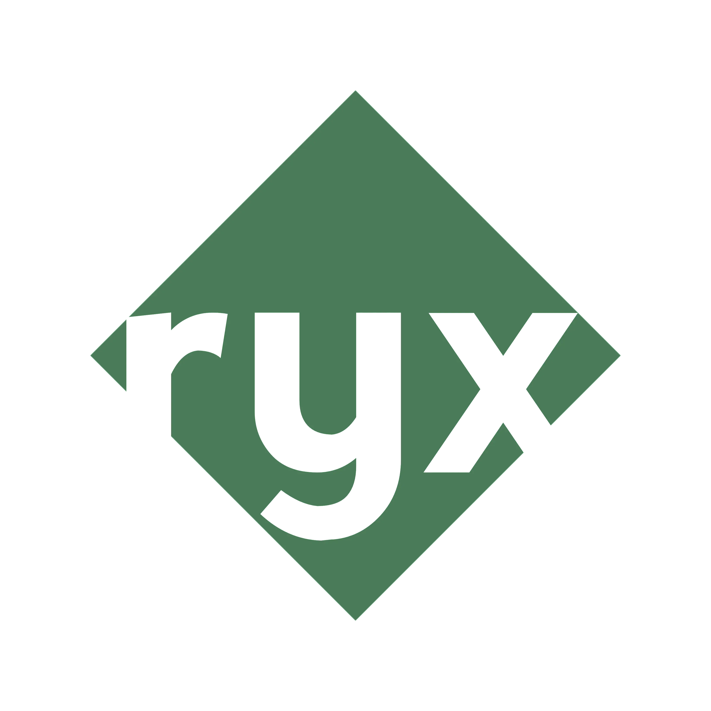

  <!-- Replace with your actual logo path -->
  

<h1 align="center">Ryx Programming Language</h1>

  <b>Modern. Fast. Reliable.</b> 
  A statically typed systems language bridging the gap between rapid development and high-performance production.

  <!-- Example Badges - Remove or update links as needed -->
  
  
  
  

  <b>Ryx</b> (formerly <b>Razen</b>) is the official language core under active development.

 

Ryx is a modern, statically typed programming language designed to give professional developers the control of systems programming with the ergonomics needed for rapid iteration and high‑performance production deployment.

## Architecture and Compilation

Ryx functions as a high-level frontend that transpiles to **C11-23**, offering a unique dual-pipeline approach. This architecture allows Ryx to remain lightweight while leveraging decades of existing compiler optimizations.

### Build Modes
Ryx distinguishes between development speed and execution speed by automatically switching backend compilers:

<table>
  <tr>
    <th width="50%">Rapid Development</th>
    <th width="50%">Production Builds</th>
  </tr>
  <tr>
    <td><b>Command:</b> <code>ryx run</code></td>
    <td><b>Command:</b> <code>ryx build</code></td>
  </tr>
  <tr>
    <td>Uses <b>TCC (Tiny C Compiler)</b> for near-instant compilation. Mimics the feedback loop of an interpreted language while executing native code.</td>
    <td>Targets <b>GCC / Clang</b> for maximum optimization. Produces highly efficient, standalone binaries suitable for deployment.</td>
  </tr>
</table>

## Community

Stay updated with the latest development news, feature polls, and announcements.

- **Official Channel:** [Join us on Arattai](https://aratt.ai/@ryx)

## Roadmap

We have a structured plan to bring Ryx from Alpha to a production-ready state. Please refer to our official roadmap documentation for detailed milestones and active development phases.

 

---

## Copyright and Licensing

  <strong>Copyright © 2025 Prathmesh Barot & Razen Core Team.</strong> 
  This project is licensed under the <strong>Apache License, Version 2.0</strong>.

> **Trademark Notice:**
> The "Ryx" name, the Ryx logo, and all related branding assets are exclusively owned by the Razen Core Team and Prathmesh Barot. They are **not** covered by the Apache License 2.0. You may not use these trademarks to endorse or promote products derived from this software without specific prior written permission.

**Custom Usage Notice:**
Unless required by applicable law or agreed to in writing, software distributed under this License is distributed on an "AS IS" BASIS, WITHOUT WARRANTIES OR CONDITIONS OF ANY KIND, either express or implied. See the [LICENSE](LICENSE) file for the specific language governing permissions and limitations under the License.